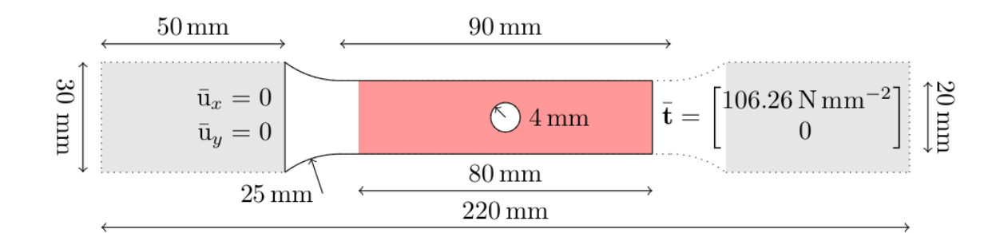
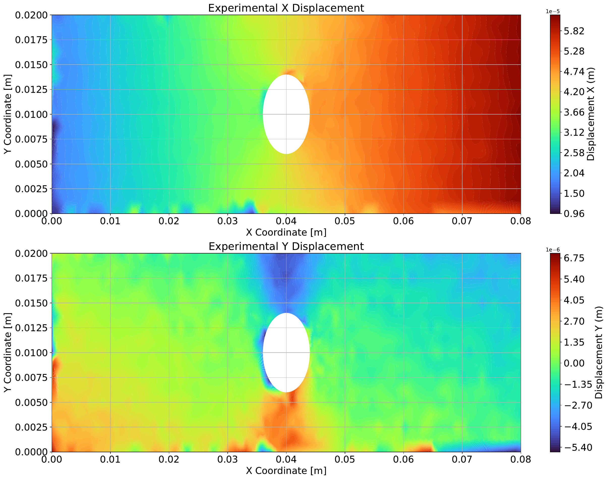
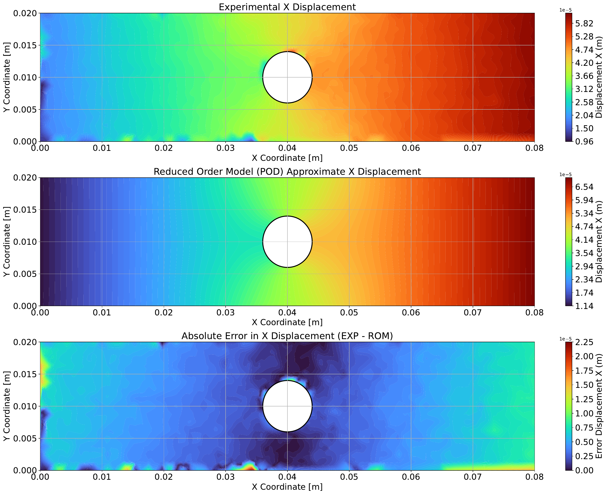
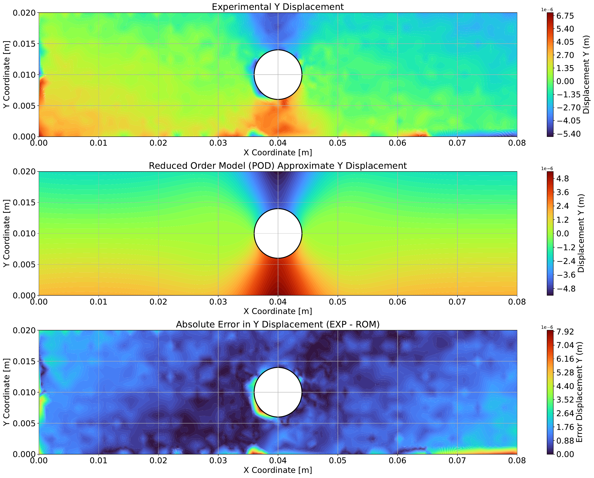
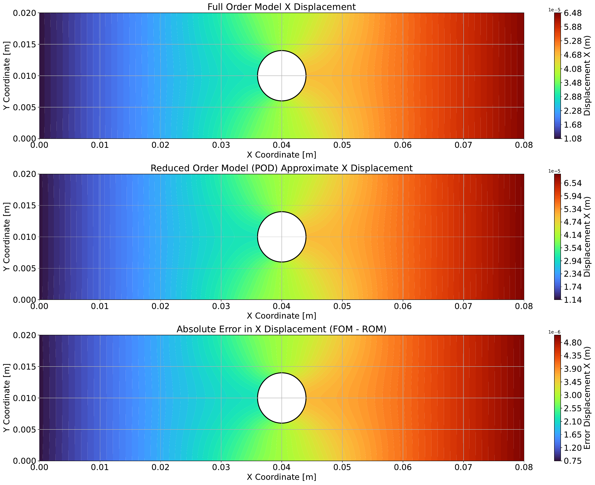
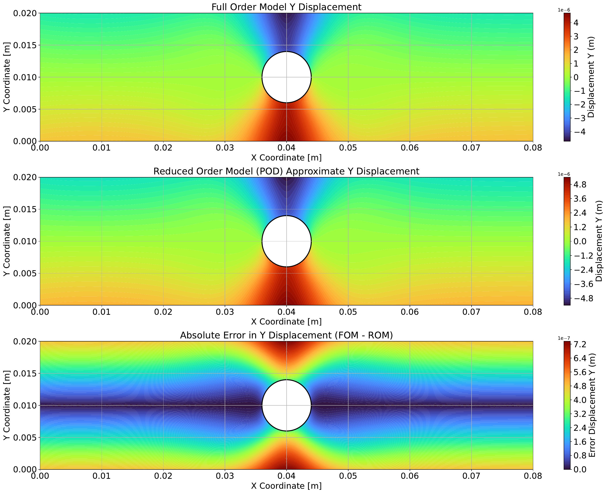

# Advanced-Data-Driven-Material-Modelling-

This repo contains my final version of Inverse Problem for material parameter estimation using Proper Orthogonal Decomposition technique

-----------------

This repository focuses on reduced-order modeling for identifying optimized material parameters from the full-field experimental data by considering linear elasticity theory into account. The parameters - Shear Modulus (G) and Bulk Modulus (K) - vectorial notation used as $\boldsymbol{\kappa}$ are first identified using the Finite Element Method in FeniCSx as the Full-Order Model (FOM) and later on Proper Orthogonal Decomposition is employed as a model order reduction approach. This reduced order model (ROM) is first benchmarked with the full order model, later on compared with the experimental data, and finally its effectiveness to be used as a surrogate to the FOM is explored.

## Identification from Full-Field Data

The objective of this project is to identify the material parameters $\boldsymbol{\kappa}$ from full-field displacement data.

The system is governed by the state equation

$$
\mathbf{F}(\mathbf{y}; \boldsymbol{\kappa}) = \mathbf{0},
$$

where $\mathbf{y}$ represents the state variable and $\boldsymbol{\kappa}$ denotes the material parameters.

The parameter identification problem is formulated as the minimization of the mismatch between simulated and measured data:

$$
\boldsymbol{\kappa}^* = \arg\min_{\kappa} \left\| \mathbf{O}(\mathbf{y}(\boldsymbol{\kappa})) - \mathbf{d} \right\|_2^2.
$$

### Simplifications

To reduce computational cost, the following simplifications are used:

- **Fixed observation operator:**  
  The observation operator $\mathbf{O}$ only selects the FEM nodes contributing to the loss. It does not depend on the state or the material parameters.

- **One-time interpolation of experimental data:**  
  The experimental displacement data is interpolated once from the sensor locations onto the FEM grid, resulting in $\tilde{\mathbf{d}}$. This avoids repeated interpolation during every optimization step.

With these modifications, the final identification problem becomes

$$
\boldsymbol{\kappa}^* = \arg\min_{\kappa} \left\| \mathbf{O}(\mathbf{y}(\boldsymbol{\kappa})) - \tilde{\mathbf{d}} \right\|_2^2
= \arg\min_{\kappa} \mathcal{L}(\mathbf{y}(\boldsymbol{\kappa})).
$$

In summary, the material parameters are identified by solving the forward problem and minimizing the loss between FEM-predicted displacements and interpolated experimental full-field data.


## Specimen Geometry and Boundary Conditions

The specimen consists of a **clamped left boundary** and a **tensile load applied on the right boundary**. The experimental dataset, provided by Tröger et al., contains two types of displacement data:

- **Raw displacement data:** measured using the **Digital Image Correlation (DIC)** method in the region enclosed by the solid boundary.
- **Interpolated displacement data:** measured displacements mapped onto equidistant points in the region of interest. These data contain some outliers caused by the stiffness of the tensile testing machine, which are removed in this study.

### Specimen Geometry

</div>
  <div style="text-align:center;">
    
    <p>Specimen Geometry - Unidirectional tensile test</p>
</div>


### Experimental Displacement Data

After removing the outliers, the interpolated experimental displacement fields $u_x$ and $u_y$ are used for the parameter identification process. 

</div>
  <div style="text-align:center;">
    
    <p>Experimental displacement plots - X and Y direction</p>
</div>
## Reduced Order Model Results

In this project, the material parameters are identified using a **surrogate model based on Proper Orthogonal Decomposition (POD)** together with experimental displacement data.

Since the experimental data is already interpolated onto the ROM grid, the **observation operator** $\mathbf{O}$ is retained in the formulation. In this study, the **ROM grid is identical to the FOM grid**, since the original FEM model contains only about **7500 nodes**. Therefore, no additional sampling points are required for generating the reduced model.

For larger FEM models with significantly more nodes, sampling strategies such as **Latin Hypercube Sampling (LHS)** could be used for snapshot generation, but this is not considered here.

The reduced-order loss function is defined as:

```math
\tilde{\mathcal{L}}(\boldsymbol{\kappa})
=
\frac{1}{2}
\left\|
\mathbf{W}
\left(
\mathbf{O}\big(\mathbf{u}_{\mathrm{POD}}(\boldsymbol{\kappa})\big)
-
\mathbf{u}_{\mathrm{data}}
\right)
\right\|_2^2
```

The corresponding optimization problem is

```math
\boldsymbol{\kappa}^* =
\arg\min_{\boldsymbol{\kappa}} \tilde{\mathcal{L}}(\boldsymbol{\kappa})
=
\arg\min_{\boldsymbol{\kappa}}
\frac{1}{2}
\left\|
\mathbf{W}
\left(
\mathbf{O}\big(\mathbf{u}_{\text{POD}}(\boldsymbol{\kappa})\big)
-
\mathbf{u}_{\text{data}}
\right)
\right\|_2^2.
```

## Results 

This section compares approximate displacement field acquired through Reduced Order Model with the experimental displacement

<table>
  <tr>
    <td align="center">
      <a href="PDF/EXP_ROM_Error_Displacement_X.pdf">
        
      </a>
      <br>
      <sub><b>ROM-EXP displacement comparison along x-direction ($U_x$) in m</b></sub>
    </td>
    <td align="center">
      <a href="PDF/EXP_ROM_Error_Displacement_Y.pdf">
        
      </a>
      <br>
      <sub><b>ROM-EXP displacement comparison along y-direction ($U_y$) in m</b></sub>
    </td>
  </tr>
</table>


Here, the comparison was done with ROM predicted material parameters on Full Order Model and Reduced Order Model.

<table>
  <tr>
    <td align="center">
      <a href="PDF/FOM_ROM_Error_Displacement_X.pdf">
        
      </a>
      <br>
      <sub><b>FOM_ROM displacement comparison along x-direction ($U_x$) in m</b></sub>
    </td>
    <td align="center">
      <a href="PDF/FOM_ROM_Error_Displacement_Y.pdf">
        
      </a>
      <br>
      <sub><b>FOM_ROM displacement comparison along y-direction ($U_y$) in m</b></sub>
    </td>
  </tr>
</table>


## Comparison of Identified Material Parameters

| Model | $K$ [GPa] | $G$ [GPa] |
|-------|-----------|-----------|
| FOM (Predicted) | 92.9 | 71.4 |
| ROM (Predicted) | 94.8 (2.04%) | 73.7 (3.22%) |

Comparison of bulk modulus ($K$) and shear modulus ($G$) obtained from the FOM and ROM predictions with respect to experimental data.


## Conclusion

This project presents a data-driven framework for identifying linear elastic material parameters from full-field experimental displacement data using FEM simulations in FEniCSx. A Proper Orthogonal Decomposition (POD)-based reduced order model was developed as a surrogate for the full-order FEM model.

The results show that the ROM provides material parameters close to the FOM results while significantly reducing computation time. The full-order model required **81.78 s** and **231 iterations**, whereas the reduced-order model reached the solution in only **0.078 s** over **242 iterations**.

For the relatively small FEM problem considered here, the full-order model remains practical. However, for larger-scale problems or more complex nonlinear material models, the reduced-order approach becomes much more attractive.

Future improvements could include snapshot scaling, mesh refinement, better sampling strategies, and a Galerkin-based projection to make the surrogate more physics-based.
