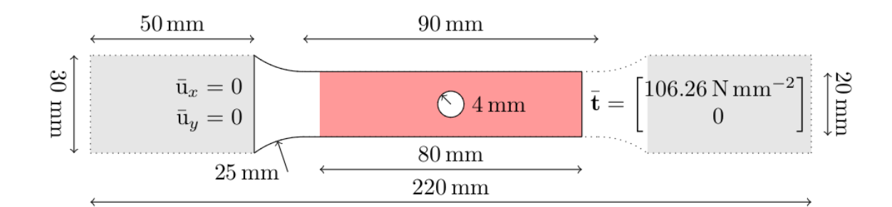
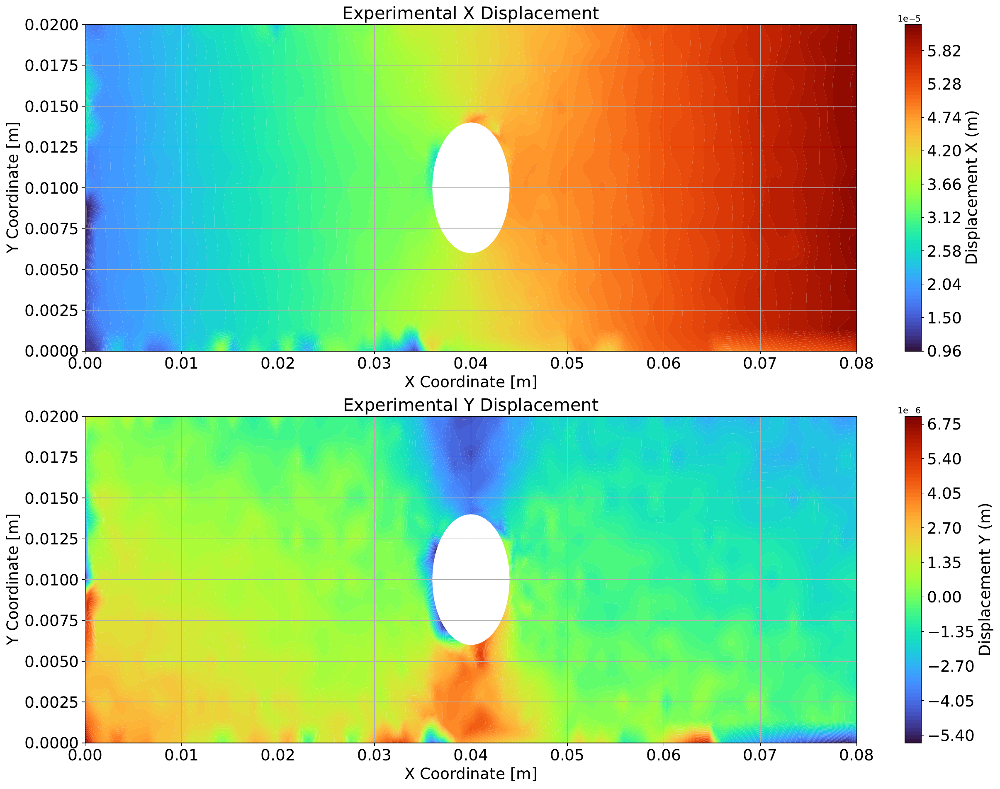
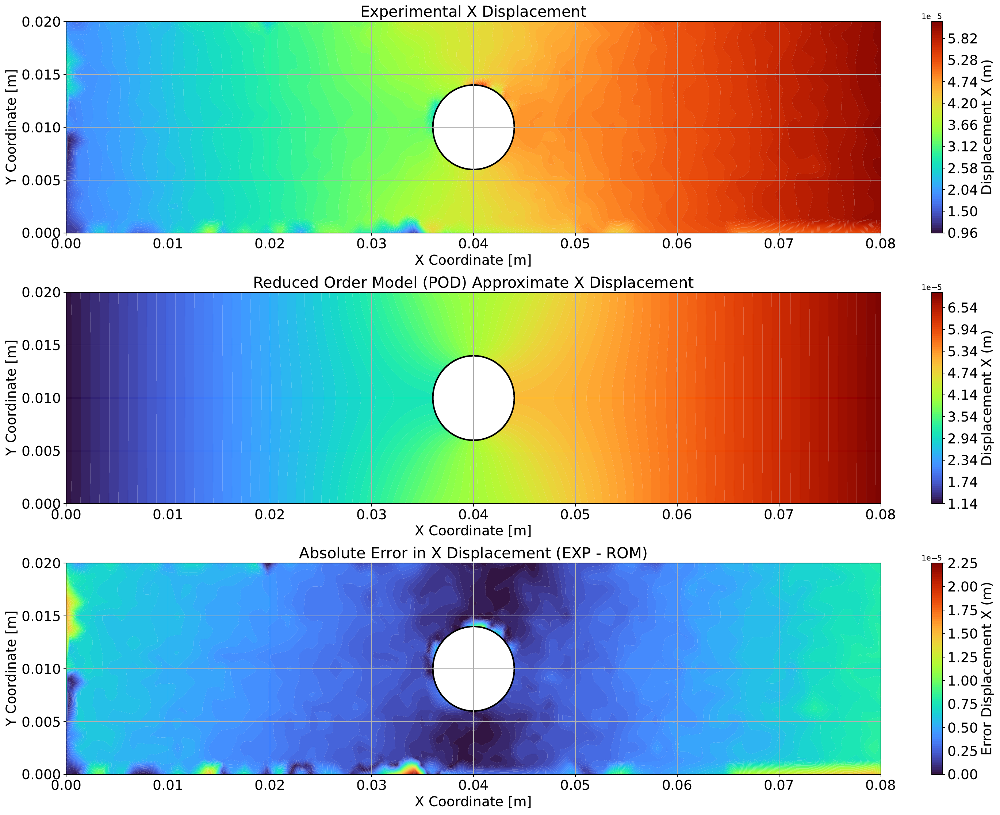
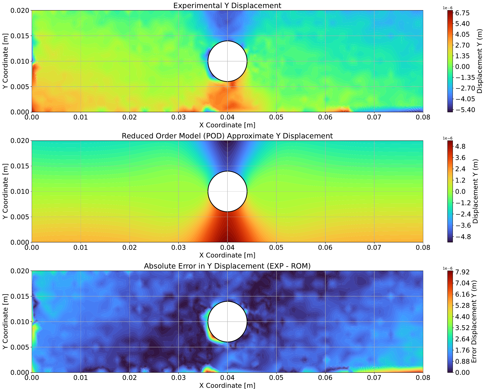
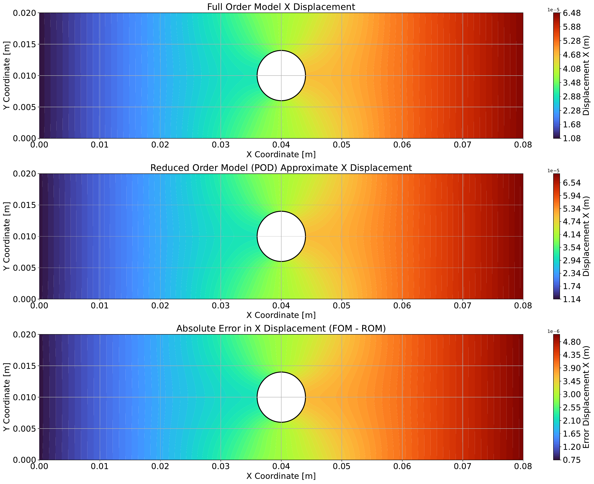
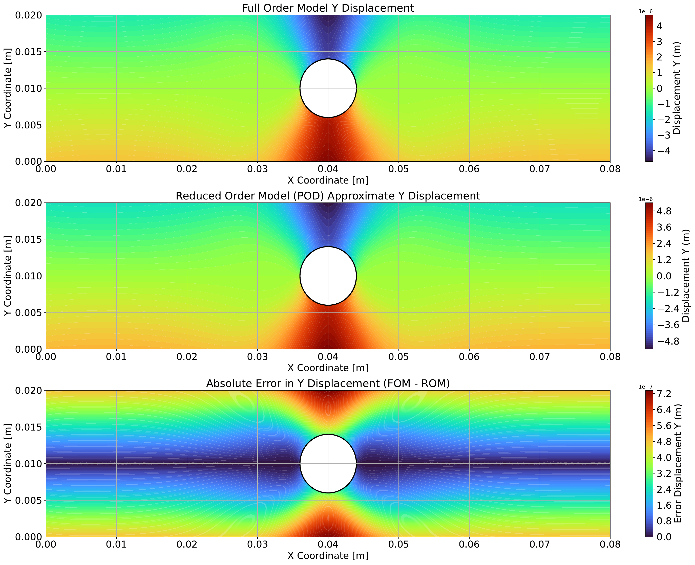

# Theory & Results

This document contains the full mathematical formulation and results for the
material-parameter identification problem. See the top-level [README](../README.md)
for a quickstart and code overview.

## Problem statement

The goal is to identify the linear-elastic material parameters — shear modulus $G$
and bulk modulus $K$, jointly written $\boldsymbol{\kappa}$ — of a tensile specimen
from full-field displacement data.

The system is governed by the state equation

$$
\mathbf{F}(\mathbf{y}; \boldsymbol{\kappa}) = \mathbf{0},
$$

where $\mathbf{y}$ is the state variable (the displacement field) and
$\boldsymbol{\kappa}$ the material parameters. The identification problem is the
minimization of the mismatch between simulated and measured data:

$$
\boldsymbol{\kappa}^* = \arg\min_{\kappa} \left\| \mathbf{O}(\mathbf{y}(\boldsymbol{\kappa})) - \mathbf{d} \right\|_2^2.
$$

### Simplifications

- **Fixed observation operator:** $\mathbf{O}$ only selects the FEM nodes
  contributing to the loss; it does not depend on the state or the material
  parameters.
- **One-time interpolation of experimental data:** the experimental displacement
  data is interpolated once from sensor locations onto the FEM grid, giving
  $\tilde{\mathbf{d}}$, avoiding repeated interpolation during optimization.

With these simplifications, the identification problem becomes

$$
\boldsymbol{\kappa}^* = \arg\min_{\kappa} \left\| \mathbf{O}(\mathbf{y}(\boldsymbol{\kappa})) - \tilde{\mathbf{d}} \right\|_2^2
= \arg\min_{\kappa} \mathcal{L}(\mathbf{y}(\boldsymbol{\kappa})).
$$

In summary: material parameters are identified by solving the forward (FEM) problem
and minimizing the loss between FEM-predicted displacements and interpolated
experimental full-field data.

## Specimen geometry and boundary conditions

The specimen is clamped on the left boundary, with a tensile load applied on the
right boundary. The experimental dataset (provided by Tröger et al.) contains:

- **Raw displacement data**, measured with Digital Image Correlation (DIC) in the
  region enclosed by the solid boundary.
- **Interpolated displacement data**, mapped onto equidistant points in the region
  of interest; some outliers caused by tensile-machine stiffness are removed.

<p align="center"></p>
<p align="center"><em>Specimen geometry — unidirectional tensile test</em></p>

<p align="center"></p>
<p align="center"><em>Experimental displacement fields, X and Y direction (outliers removed)</em></p>

## Reduced-order model

Material parameters are identified using a surrogate model built from Proper
Orthogonal Decomposition (POD) of the FOM displacement field, combined with an RBF
regressor that maps $(G, K) \to$ POD coefficients.

Since the experimental data is already interpolated onto the ROM grid, the
observation operator $\mathbf{O}$ is retained in the formulation. The ROM grid is
identical to the FOM grid here since the FE mesh has only ~7500 nodes, so no
additional snapshot sampling points are required. For larger FE models, Latin
Hypercube Sampling (LHS) could be used to select snapshot sample points instead.

The reduced-order loss function:

```math
\tilde{\mathcal{L}}(\boldsymbol{\kappa})
=
\frac{1}{2}
\left\|
\mathbf{W}
\left(
\mathbf{O}\big(\mathbf{u}_{\mathrm{POD}}(\boldsymbol{\kappa})\big)
-
\mathbf{u}_{\mathrm{data}}
\right)
\right\|_2^2
```

with the corresponding optimization problem

```math
\boldsymbol{\kappa}^* =
\arg\min_{\boldsymbol{\kappa}} \tilde{\mathcal{L}}(\boldsymbol{\kappa}).
```

## Results

Comparison of the ROM-approximated displacement field against the interpolated
experimental displacement field:

<table>
  <tr>
    <td align="center">
      
      <br><sub><b>ROM vs. experimental displacement, X direction</b></sub>
    </td>
    <td align="center">
      
      <br><sub><b>ROM vs. experimental displacement, Y direction</b></sub>
    </td>
  </tr>
</table>

Comparison of FOM vs. ROM displacement fields, both evaluated at the ROM-identified
material parameters:

<table>
  <tr>
    <td align="center">
      
      <br><sub><b>FOM vs. ROM displacement, X direction</b></sub>
    </td>
    <td align="center">
      
      <br><sub><b>FOM vs. ROM displacement, Y direction</b></sub>
    </td>
  </tr>
</table>

### Identified material parameters

| Model            | $K$ [GPa]     | $G$ [GPa]     |
|------------------|---------------|---------------|
| FOM (predicted)  | 92.9          | 71.4          |
| ROM (predicted)  | 94.8 (+2.04%) | 73.7 (+3.22%) |

### Timing

| Model | Time    | Iterations |
|-------|---------|------------|
| FOM   | 81.78 s | 231        |
| ROM   | 0.078 s | 242        |

The ROM reaches material parameters within ~2-3% of the FOM's, at roughly **1000x**
the speed — the FOM identification takes ~82 s, the ROM-based one ~0.08 s. For this
small FE problem the FOM is still tractable on its own; for larger or nonlinear
models, the reduced-order surrogate becomes the only practical option for iterative
identification.

## Future improvements

- Snapshot scaling/normalization before SVD.
- Mesh refinement study.
- Latin Hypercube (or other structured) sampling strategy for snapshot generation
  at scale.
- Galerkin-projection-based ROM (physics-informed) as an alternative to the
  purely data-driven RBF surrogate.
